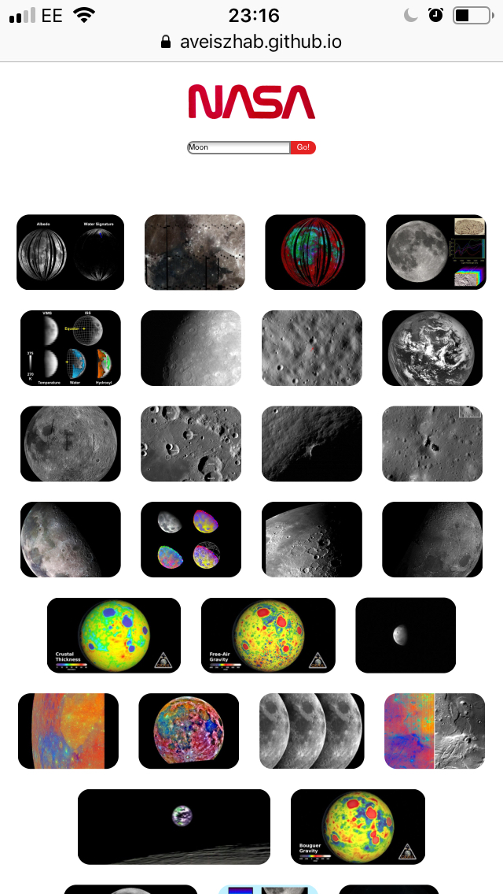
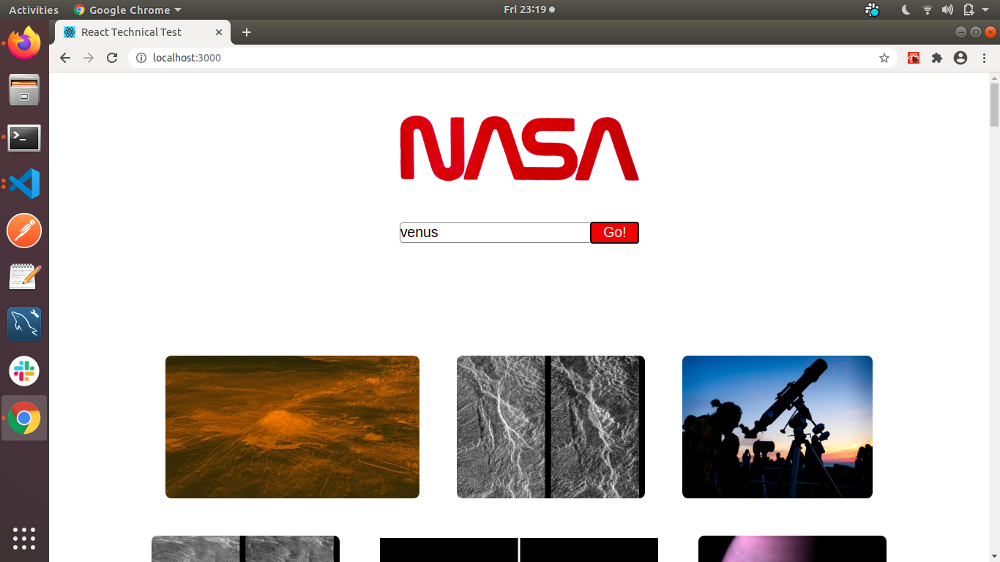

# React Technical Test

It was expected to build a React web application that allows users to search for images based on a query relating to space.

Necessary functionalities need to be implemented:
* A Search page which allows users to search for images by keyword
* Images must be returned upon a successful search

# Deployment
App was deployed on GitHub pages

https://aveiszhab.github.io/tech-test/

# Screenhots

## Mobile

## Desktop

# Development utilities used:

* The App was built using REACT
* Testing: Jest, React Testing Library
* Packages: Axios, PropTypes

# To run the App

* Clone the repo:
git clone git@github.com:aveiszhab/tech-test.git

* Open the app on localhost:
npm start 

* Start searching for space images by typing in search keywords into the textbox. Press go and you should be able to see the images related to the search keyword.

# Possible improvements:
* adding mock API testing

# Author:
Aniko Veiszhab

